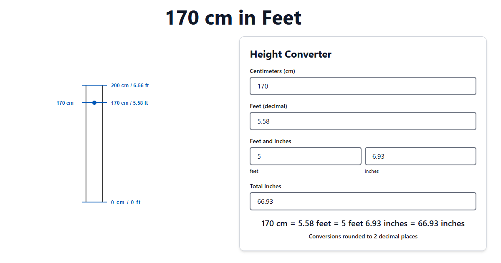

# 170cminfeet.com

> A super lightweight, SEO-optimized height converter from **170cm to feet and inches** – built for speed, simplicity, and specificity.

---

## 🌐 Live Site

👉 [https://170cminfeet.com](https://170cminfeet.com)

---

## 🧠 Why This Exists

Thousands of people search for phrases like **“170 cm in feet”** every day. Most end up on bloated unit converter websites or generic calculators.

This project provides:
- ⚡ Instant, clear answers
- 📱 Mobile-first layout
- 🧘 No ads, no tracking
- 🔍 SEO-optimized single-intent pages

It’s a micro-site built for one job — and it does that job fast.

---

## 🚀 Features

- ✅ Converts 170cm into feet/inches automatically
- 🧾 Semantic HTML with proper meta tags
- 🧠 Fully static, no frameworks
- 🌍 Easy to scale for other values (e.g., 160cm, 180cm, etc.)
- 🌩 Deployed via [Vercel](https://vercel.com)
- ☁️ Images served via [Cloudflare R2](https://www.cloudflare.com/products/r2/)

---
